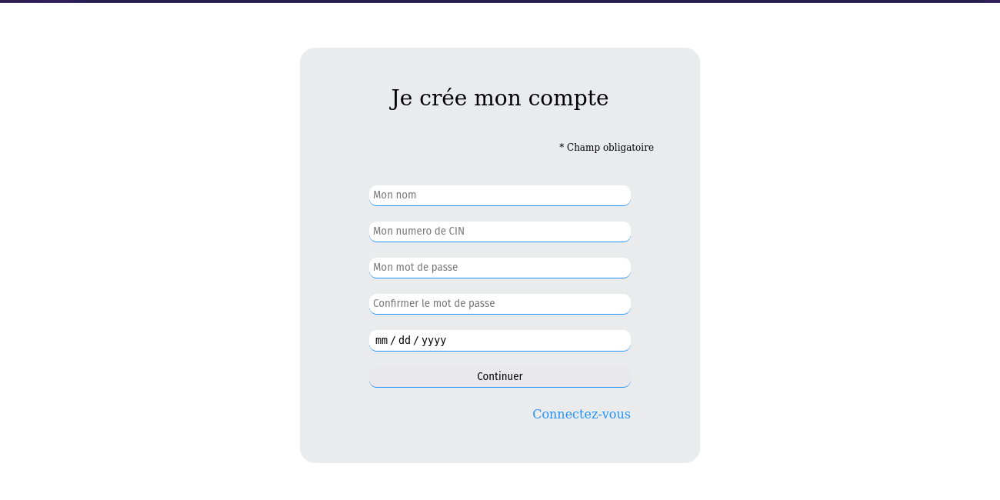
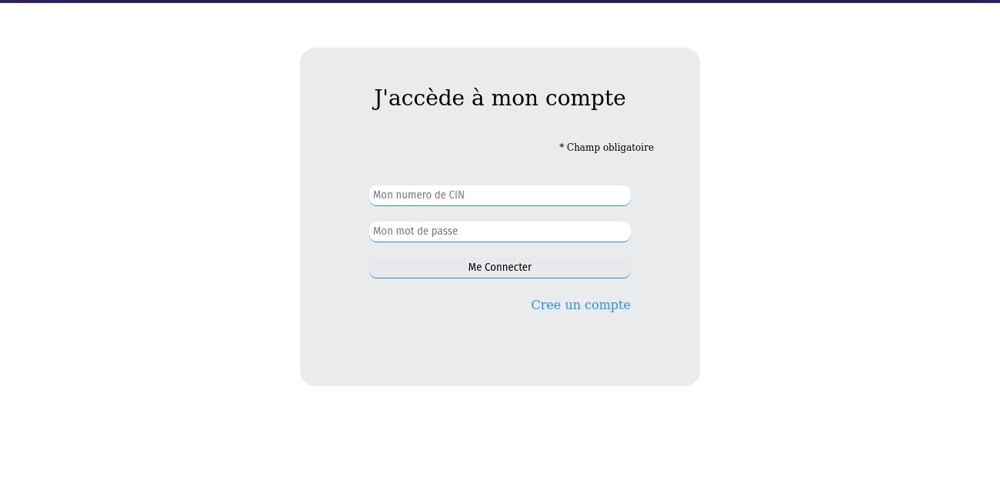
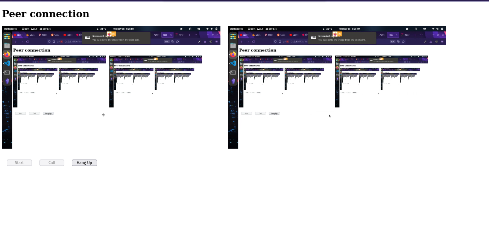
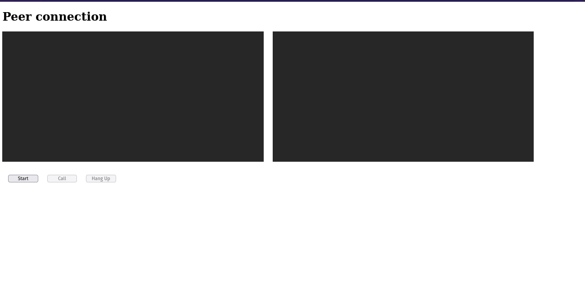
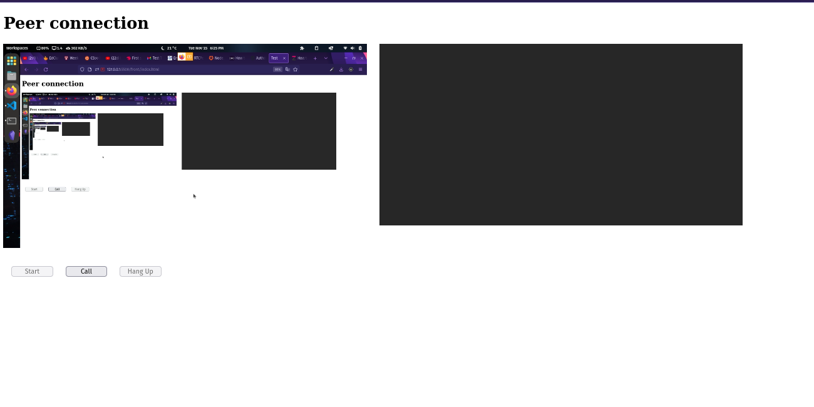
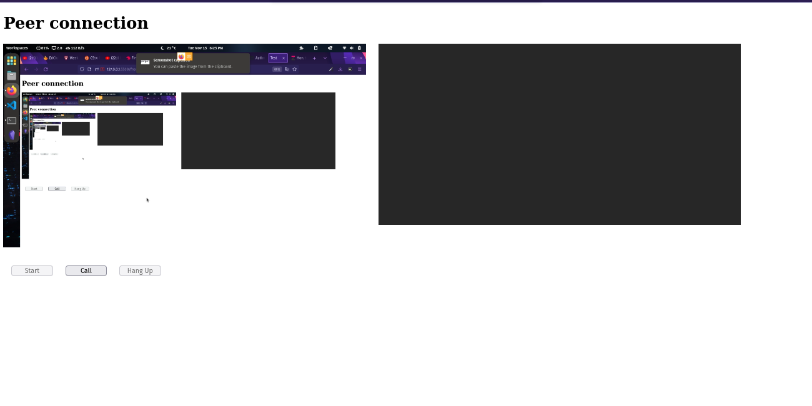

<h1 align="center">Test Technique</h1>
---

## 📝 Table of Contents

- [About](#about)
- [Getting Started](#getting_started)
- [Built Using](#built_using)
- [Authors](#authors)

## 🧐 About <a name = "about"></a>

This project is a technical assignment,
it run using Nodejs/express for the authentication and javascript and Html/CSS for the front end.

Using the WebRTC librery, to establish a peer-to-peer connection between two pc.
Sharing in a one way the full screen for the other user.


The user start by entring the CIN, name, passowrd and the birth date to register.



And to login enter CIN and password.



In this case I make it so that both screen present in the same tab just for the presentation and as exemple only.



At first the user have to start the screen streaming by clicking start



Now the user have the option to start the call.



And finally the screen have been shared the other screen.


And end the call by clicking Hang up.


## 🏁 Getting Started <a name = "getting_started"></a>

```
git clone https://github.com/Yosri-ctrl/wefastTest.git
```
```
cd server
```
```
npm install
```
```
npm run start
```

### Prerequisites


```
nodejs v19.0.1
mongo v4.0.3
```


## ⛏️ Built Using <a name = "built_using"></a>

- [MongoDB](https://www.mongodb.com/) - Database
- [Express](https://expressjs.com/) - Server Framework
- [javascript](https://vuejs.org/) - Web development languge
- [NodeJs](https://nodejs.org/en/) - Server Environment

## ✍️ Authors <a name = "authors"></a>

- [Yosri](https://github.com/Yosri-ctrl)
